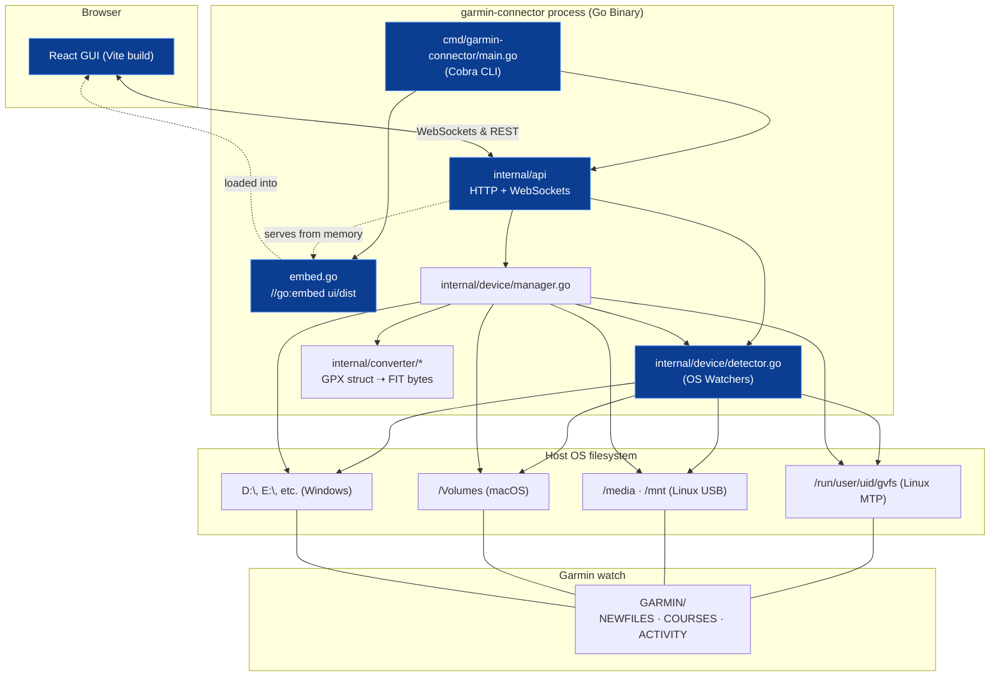

# Constitution

The constitution is not itself a spec with requirements to implement — it is the **sum of the walking-skeleton specs**, plus the scope, tech stack, and architecture that frame every spec in this repository. It changes rarely and deliberately.

## 1. Purpose, Goal & Requirements

### 1.1 Purpose & Goal

- **Purpose**: A lightning-fast, cross-platform (Linux, Windows, macOS) single-binary CLI tool with an integrated local web GUI to connect to a Garmin Venu (or compatible) watch over USB, view connection status, ingest GPX routes (auto-converted to FIT), manage course files on the watch, and preview a selected course's path on a map — featuring a Cyberpunk Terminal aesthetic.
- **Goal**: To deliver a strictly spec-driven, fault-tolerant MVP that adheres to a "walking skeleton" architecture. The specification corpus serves as the single source of truth and blueprint for single-shot AI code generation. The application is distributed as a standalone binary with embedded frontend assets to ensure zero-dependency installation and real-time reactive UX.

### 1.2 Functional Requirements (FR)

The system fulfills the following functional requirements across its walking skeleton and feature layers:

- **FR-1: Cross-Platform Device Discovery**: Automatically detect connected Garmin watches across supported OS mount points (Linux GVFS/MTP & `/media`/`/mnt`, macOS `/Volumes`, Windows drive letters `A:\`–`Z:\`) without manual mount path configuration.
- **FR-2: Device Metadata Extraction**: Read and parse `GarminDevice.xml` (case-insensitive, XML namespaces stripped) to extract identifying metadata (`model_name`, `unit_id`, `software_version`, `part_number`) with graceful fallbacks on missing or malformed XML.
- **FR-3: Subdirectory Resolution**: Locate `NEWFILES`, `COURSES`, and `ACTIVITY` directories case-insensitively, automatically inferring default paths for `NEWFILES` and `COURSES` if absent.
- **FR-4: Route Ingestion & FIT Conversion**: Ingest `.gpx` and `.fit` route files via GUI drag-and-drop or headless CLI. Automatically unmarshal GPX trackpoints/waypoints and encode them into valid Garmin binary FIT format (`.fit`) adhering to Garmin string field limits (≤ 15 bytes UTF-8) and protocol CRC checks.
- **FR-5: Device Sideloading**: Write converted `.fit` files directly into the connected watch's `NEWFILES/` directory to trigger native Garmin course synchronization.
- **FR-6: Watch Course Management**: List all course files residing in `COURSES/` (active) and `NEWFILES/` (pending sync) with filenames, locations, byte sizes, and UTC modified timestamps. Support deleting specific courses from device storage by filename.
- **FR-7: Interactive Map Preview**: Parse course trackpoints from watch files or incoming routes, extract coordinate polyline arrays, and render an interactive Leaflet map preview with dark telemetry tiles and an auto-centered bounding box.
- **FR-8: Continuous Connection Telemetry**: Provide real-time connection status (`disconnected`, `mounting`, `connected`, `model_name`) pushing updates from the OS event listener to the GUI via WebSockets (or Server-Sent Events).
- **FR-9: Process & Server Management**: Provide a CLI entrypoint (`garmin-connector gui`) to launch the local HTTP server on a configurable host/port, serve embedded frontend assets from memory, and handle cleanly shutting down on SIGINT/SIGTERM.

### 1.3 Non-Functional Requirements (NFR)

The system complies with the following non-functional constraints and quality attributes:

- **NFR-1: Architectural Isolation & Boundaries**:
  - `internal/device` is strictly read-only for detection. File mutation happens in a distinct manager package.
  - `internal/converter` is completely decoupled from device and transport logic (in-memory data structures and byte streams only).
  - `internal/api` encapsulates all HTTP/JSON/WebSocket transport concerns.
  - `ui/` is compiled to static assets (`dist/`) and embedded directly into the Go binary via `go:embed`.
- **NFR-2: Fault Tolerance & Graceful Degradation**:
  - Never terminate or crash the server process on per-request errors (invalid uploads, conversion errors, premature watch disconnection).
  - Absence of a connected watch is a standard valid state, never an exception or HTTP 500 error.
  - Device detection relies on robust OS hooks but must gracefully retry or poll if file system notifications (`fsnotify`) fail.
- **NFR-3: Minimal Footprint & Single Binary Distribution**:
  - The application compiles to a single, statically linked binary for target platforms (Windows `.exe`, macOS and Linux binaries).
  - Zero runtime dependencies (no Node.js, Python, or local web servers needed to run).
  - Low CPU and memory footprint suited for background execution.
- **NFR-4: Hardware Protocol Conformance**:
  - Strict adherence to Garmin FIT binary format, byte endianness, and string length limits (course and course point names null-terminated within 16-byte fields).
  - Robust tolerance of FAT32/MTP directory casing variations.
- **NFR-5: Spec-Driven Single-Shot Rebuildability**:
  - The specification corpus serves as the deterministic oracle; specs must remain unambiguous enough for an autonomous agent to regenerate the `cmd/`, `internal/`, and `ui/` structure end-to-end.
  - Continuous verification: all walking-skeleton and feature contracts must pass automated tests (`go test`) upon generation.

### 1.4 Target Release & Scope

**Target release:** v2.0.0 (The Go + React Architecture Redesign) — single-shot generation from this spec corpus.

**In scope:** everything described by a spec in this directory (skeleton or feature).
**Out of scope:** see §6.

## 2. The Walking Skeleton

The walking skeleton is not prose here — it is the sum of the specs tagged `tier: skeleton`. Each is independently maintained; this section only enumerates and orders them. A spec earns skeleton tier if the app cannot prove "it runs, end-to-end, at all" without it — removing any one of these breaks the whole chain, not just a feature.

| Order | Spec | Proves |
|---|---|---|
| 1 | [cli-entrypoint](cli-entrypoint.md) | The Cobra CLI starts. |
| 2 | [gui-bootstrap](gui-bootstrap.md) | Go HTTP router serves the embedded Vite/React app and answers REST/WebSocket handshakes. |
| 3 | [device-detection](device-detection.md) | The Go OS watcher can truthfully sense whether a watch is attached. |
| 4 | [connection-status-shell](connection-status-shell.md) | The React frontend reflects that truth (disconnected / mounting / connected) via WebSockets. |

Every `tier: feature` spec (under `features/`) is layered on top of this chain and must degrade gracefully to "not available" if the skeleton is intact but the feature is missing or broken — never the other way around.

## 3. Architecture



### Repository layout

```
garmin-venu-x1/
├── spec/                          # source of truth
├── cmd/
│   └── garmin-connector/
│       └── main.go                 # CLI entrypoint (cobra)
├── internal/
│   ├── device/                     # OS-specific mount detection (Linux/Win/Mac)
│   ├── converter/                  # GPX unmarshaling & FIT binary encoding
│   └── api/                        # WebSocket handlers and REST routes
├── ui/                             # The React frontend
│   ├── src/
│   │   ├── components/
│   │   └── App.tsx
│   ├── tailwind.config.js
│   ├── vite.config.ts
│   └── package.json
├── embed.go                        # //go:embed ui/dist triggers the frontend bundling
├── go.mod
└── go.sum
```

### Architecture boundaries (non-negotiable)

- **`internal/device/detector.go` is read-only.** It must never write, move, or delete anything.
- **`internal/converter` has zero device knowledge.** It only ever deals with in-memory data structures (GPX structs, FIT bytes) — never touches `internal/device`.
- **`internal/api` is the only place HTTP/WebSocket concerns exist.** `internal/device` and `internal/converter` remain usable headless CLI commands.
- **`ui/` is fully compiled via Vite.** It communicates with the Go backend exclusively via REST APIs and WebSockets.
- **The CLI has headless capability.** Subcommands like `gui`, `sideload`, and `list` are fully supported to bypass the GUI.

## 4. Tech Stack (fixed)

- **Language:** Go 1.22+
- **CLI Framework:** `github.com/spf13/cobra`
- **Routing:** Standard library `net/http` + WebSockets (`github.com/gorilla/websocket` or equivalent)
- **Frontend Framework:** React 18+ with TypeScript, bundled by Vite.
- **Styling:** Tailwind CSS (configured for the Cyberpunk aesthetic).
- **Mapping:** `react-leaflet` and Leaflet (installed via npm).
- **Go FIT/GPX libraries:** Appropriate Go libraries (e.g., `github.com/tormoder/fit`) for unmarshaling XML and packing FIT binaries.

## 5. Cross-cutting invariants

- **Never crash the server process on a per-request error.** Return JSON error payloads (`{"success": false, "error": "..."}`) with appropriate HTTP statuses.
- **No device present is not an error state.** The frontend will gracefully display a "Waiting for Device" cyberpunk scanline UI.
- **Garmin string field limits are respected wherever names are written into FIT data**: course name ≤ 15 bytes UTF-8.
- **Filesystem paths under a device's `GARMIN/` directory are case-insensitive matched** (`NEWFILES`, `COURSES`, `ACTIVITY`).
- **WebSockets for State:** Connection telemetry is pushed instantly; no more 3-second polling loops.
- **No dead code.** Every Go package described by a spec MUST be reachable from the CLI or the HTTP API.

## 6. Explicitly out of scope (until a spec says otherwise)

- Multiple simultaneously connected watches (only the first detected device is used).
- Activity file (`.fit` in `ACTIVITY/`) download/analysis — only `COURSES/` and `NEWFILES/` are managed.
- Authentication/multi-user access to the GUI (local tool only).
- DEM-based elevation enrichment (see [gpx-fit-conversion](features/gpx-fit-conversion.md) Non-Goals).

## 7. Regeneration & Testing Requirement

Per [spec/README.md](README.md)'s "rebuild test," a single-shot (re)generation from this corpus — run per [regeneration.md](regeneration.md) — must pass:

- **Go Tests:** `go test ./...` must pass across all internal packages.
- **CLI Boot:** `garmin-connector --help` must run cleanly.
- **UI Build:** `cd ui && npm run build` must successfully compile to `ui/dist`.
- **Skeleton Boot:** Running `garmin-connector gui` on a free port serves the frontend and successfully upgrades a WebSocket connection.
