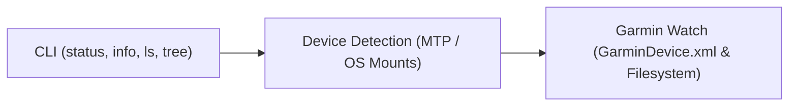

# Constitution

## 1. Purpose

A tool to connect a modern garmin watch to a laptop to exchange files over a USB connection.

## 2. Grounding Reality

### 2.1 External Facts
Facts are objective, verifiable truths about the external environment (hardware, third-party APIs, operating systems) that exist independently of this software.

| ID | Fact | Verification Method | Impact / Traces |
|---|---|---|---|
| **FCT-1** | The Garmin Venu X1 only supports the MTP protocol (no USB Mass Storage support). | USB device descriptor inspection (`lsusb` / OS device query) | Informs `FR-1` |
| **FCT-2** | `GarminDevice.xml` is the file that holds the device's metadata. | File inspection within `GARMIN/` filesystem root | Informs `FR-2`, `FR-5` |
| **FCT-3** | Garmin devices expose a `GARMIN` directory, but MTP often abstracts this behind a logical volume folder (e.g., `Internal Storage/`), meaning it may be nested 1-2 levels deep. | Mount structure inspection | Informs `FR-1`, `FR-2`, `FR-4`, `FR-5` |
| **FCT-4** | Linux dynamically mounts MTP devices via GVFS under `/run/user/<uid>/gvfs` using an `mtp:` prefix. | Linux GVFS documentation/testing | Informs `FR-1` |
| **FCT-5** | `GarminDevice.xml` contains specific metadata fields. `Description`, `SoftwareVersion`, and `PartNumber` are nested inside the `<Model>` tag. `Id` is at the root. Subsystem versions and Connect IQ app definitions are nested under `<MassStorageMode>` and `<Extensions>`. | XML file inspection | Informs `FR-2`, `FR-5` |
| **FCT-6** | `GarminDevice.xml` utilizes XML namespaces, which complicates standard parsing if not stripped. | XML file inspection | Informs `FR-2`, `FR-5` |
| **FCT-7** | Linux USB mount paths are highly fragmented across Desktop Environments and volume managers (GVFS, udisks2, manual). | OS architecture | Informs `FR-1` |
| **FCT-8** | Garmin watches expose internal storage over MTP with unpredictable character casing (e.g., `GARMIN` vs `Garmin`). | Filesystem inspection | Informs `FR-1`, `FR-2`, `FR-4`, `FR-5` |
| **FCT-9** | Scanning wildcard paths like `/run/user/*` on a multi-user Linux system triggers OS-level `EACCES` (Permission Denied) errors. | OS security model | Informs `FR-1` |
| **FCT-10** | MTP file traversal is significantly slower than local disk access, causing severe latency on deep recursive directory scans. | MTP protocol limits | Informs `FR-4` |
| **FCT-11** | MTP does not reliably expose standard POSIX metadata (symlinks, permissions, ownership). | MTP protocol limits | Informs `FR-4` |

### 2.2 Assumptions
Assumptions are beliefs about user behavior, workflows, or integration needs that justify architectural decisions.

| ID | Assumption | Verification Method | Impact / Traces |
|---|---|---|---|
| **ASM-1** | Users and external systems invoke the tool on-demand to query state, rather than connecting to a persistent background daemon. | User research / workflow analysis | Informs `FR-3`, `FR-4`, `FR-5` |
| **ASM-2** | External scripts/tools require machine-readable structured output to consume device status headlessly. | Integration requirements | Informs `FR-3`, `FR-4`, `FR-5` |
| **ASM-3** | Users typically connect only one Garmin watch via USB at any given time; surfacing the first detected device is sufficient. | User research | Scopes `FR-1` |
| **ASM-4** | Knowing a device is connected is more valuable than strict metadata accuracy; graceful degradation is preferred over a hard failure. | Product decision | Scopes `FR-2`, `FR-5` |
| **ASM-5** | For file inspection, basic filesystem structure and metadata (name, size, modification time) are sufficient; complete POSIX file semantics are unnecessary. | Product decision | Scopes `FR-4` |
| **ASM-6** | Deep recursive directory traversal is only useful if it returns quickly; imposing limits prevents the CLI from hanging indefinitely on MTP endpoints. | User experience | Scopes `FR-4` |

## 3. Requirements

### 3.1 Functional Requirements
- **FR-1: Linux Device Discovery**: Automatically detect connected Garmin watches across Linux mount points and GVFS/MTP paths (e.g., `/run/user/<uid>/gvfs`, `/media`, `/mnt`) without manual mount path configuration.
- **FR-2: Device Metadata Extraction**: Read and parse `GarminDevice.xml` (case-insensitive, XML namespaces stripped) to extract identifying metadata with graceful fallbacks on missing or malformed XML.
- **FR-3: CLI Status Inspection**: Provide a CLI command (`garmin-connector status`) to inspect and report device connection status and metadata to stdout in human-readable text or structured JSON (`--json`).
- **FR-4: Read-Only Filesystem Inspection**: Provide CLI commands (`ls`, `tree`) to explore the watch's internal filesystem structure and basic metadata without modifying contents.
- **FR-5: Detailed Diagnostics and Storage Inspection**: Provide a CLI command (`garmin-connector info`) to report real-time filesystem capacity metrics, installed Connect IQ applications, and sub-component firmware versions in human-readable text or structured JSON (`--json`).

### 3.2 Non-Functional Requirements
- **NFR-1: Fault Tolerance**: Absence of a connected watch is a valid state (exits `0`), never an exception. Unexpected disconnects or missing metadata must not cause unhandled crashes.
- **NFR-2: Minimal Footprint**: Low CPU and memory overhead with zero external runtime dependencies.
- **NFR-3: Exclusive Dependencies**: All dependencies must be strictly exclusive to this repository and its chosen tech stack.

## 4. Architecture

## 5. Tech Stack

- **Language:** Go (Golang) — Chosen to satisfy NFR-2 (zero external runtime dependencies, compiled static binary) and NFR-3.

## 6. Out of Scope
- Graphical User Interface (GUI).
- Non-Linux operating systems (macOS, Windows).
- Course and activity file management, conversion, or sideloading.
- Multiple simultaneously connected watches.
