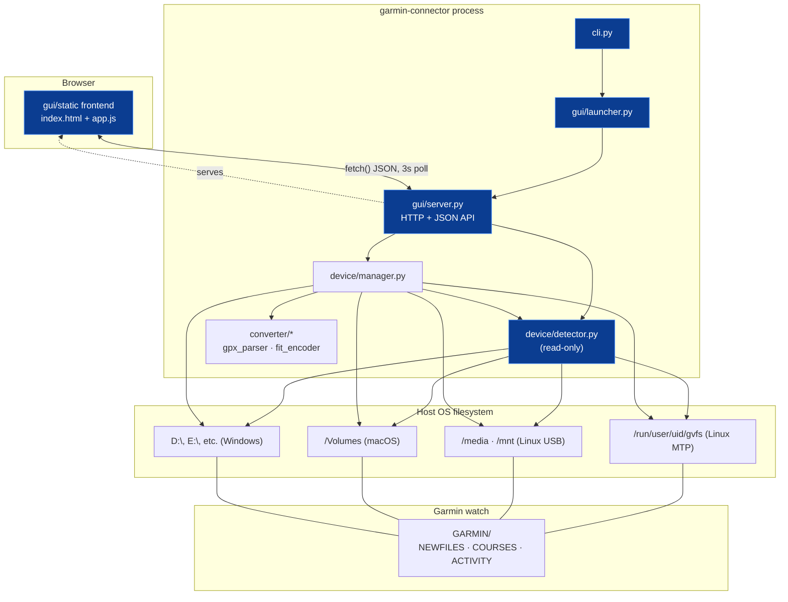

# Constitution

The constitution is not itself a spec with requirements to implement — it is the **sum of the walking-skeleton specs**, plus the scope, tech stack, and architecture that frame every spec in this repository. It changes rarely and deliberately.

## 1. Purpose & Scope

A lightweight, cross-platform (Linux, Windows, macOS) tool to connect to a Garmin Venu (or compatible) watch over USB, view connection status, ingest GPX routes (auto-converted to FIT), manage course files on the watch, and preview a selected course's path on a map — delivered as a local web GUI with a Cyberpunk Terminal aesthetic.

**Target release:** v1.0.0 — the first single-shot generation from this spec corpus is the MVP. `pyproject.toml`'s version bumps to `1.0.0` as part of that generation.

**In scope:** everything described by a spec in this directory (skeleton or feature).
**Out of scope:** see §6.

## 2. The Walking Skeleton

The walking skeleton is not prose here — it is the sum of the specs tagged `tier: skeleton`. Each is independently maintained; this section only enumerates and orders them. A spec earns skeleton tier if the app cannot prove "it runs, end-to-end, at all" without it — removing any one of these breaks the whole chain, not just a feature.

| Order | Spec | Proves |
|---|---|---|
| 1 | [cli-entrypoint](cli-entrypoint.md) | The process starts. |
| 2 | [gui-bootstrap](gui-bootstrap.md) | It serves a page and answers `/api/device`, without crashing. |
| 3 | [device-detection](device-detection.md) | It can truthfully sense whether a watch is attached. |
| 4 | [connection-status-shell](connection-status-shell.md) | The page reflects that truth (disconnected / mounting / connected), continuously, without getting stuck. |

Every `tier: feature` spec (under `features/`) is layered on top of this chain and must degrade gracefully to "not available" if the skeleton is intact but the feature is missing or broken — never the other way around.

## 3. Architecture



Darker/highlighted nodes are on the walking skeleton's critical path.

### Repository layout

```
garmin-venu-x1/
├── spec/                          # source of truth — see spec/README.md
│   ├── constitution.md            # this file
│   ├── regeneration.md            # single-shot rewrite runbook
│   ├── cli-entrypoint.md          # [skeleton]
│   ├── gui-bootstrap.md           # [skeleton]
│   ├── device-detection.md        # [skeleton]
│   ├── connection-status-shell.md # [skeleton]
│   ├── templates/
│   │   └── spec-template.md
│   └── features/
│       ├── device-manager.md
│       ├── gpx-fit-conversion.md
│       ├── course-management-api.md
│       ├── gui-course-frontend.md
│       └── ui-design.md
├── src/garmin_connector/
│   ├── cli.py
│   ├── device/
│   │   ├── detector.py
│   │   └── manager.py
│   ├── converter/
│   │   ├── gpx_parser.py
│   │   ├── fit_encoder.py
│   │   └── gpx_to_fit.py
│   └── gui/
│       ├── launcher.py
│       ├── server.py
│       └── static/
│           ├── index.html
│           ├── app.js
│           ├── styles.css
│           └── cybercore.min.css
├── tests/                         # regression oracle; test_skeleton.py covers constitution §7
├── examples/                      # fixtures
└── pyproject.toml
```

### Architecture boundaries (non-negotiable)

- **`device/detector.py` is read-only.** It must never write, move, or delete anything on the watch or host filesystem.
- **`converter/*` has zero device knowledge.** It only ever deals with in-memory data (`CourseData`, GPX text, FIT bytes) and local file I/O — never touches `device/*`.
- **`gui/server.py` is the only place HTTP concerns exist.** `device/*` and `converter/*` must remain usable as a plain Python library with no HTTP/JSON dependency.
- **`gui/static/*` has no build step.** Plain HTML/CSS/JS served as-is from disk; no bundler, no npm dependency, no transpilation.
- **The CLI has exactly one subcommand today: `gui`.** Any new subcommand is a feature-level spec addition, not a constitution change.

## 4. Tech Stack (fixed)

- Python ≥ 3.10, packaged via `setuptools`, `src/` layout (`src/garmin_connector/`).
- Runtime dependency: `fitparse` only (used solely for reading `.fit` files back out in the course-management API's fetch-course endpoint — not for writing). `gpxpy` was previously declared but never imported; it is dropped under the "no dead code" invariant — GPX parsing is stdlib `xml.etree.ElementTree`.
- Dev dependency: `pytest`.
- No web framework (Flask/FastAPI/etc.) — `http.server.HTTPServer` + `BaseHTTPRequestHandler` only.
- No frontend framework/bundler — vanilla JS, Leaflet.js (CDN) for mapping, CYBERCORE CSS (vendored `cybercore.min.css`) for styling, Google Fonts (Exo 2, JetBrains Mono, Orbitron, Rajdhani) via CDN.

## 5. Cross-cutting invariants

- **Never crash the server process on a per-request error.** Every API handler must catch exceptions and return a JSON error body (`{"success": false, "error": "..."}` or `{"connected": false, ...}`) with an appropriate HTTP status, not propagate.
- **No device present is not an error state.** Every endpoint must degrade gracefully (empty course list, `connected: false`, etc.) rather than 500 when no watch is attached.
- **Garmin string field limits are respected wherever names are written into FIT data**: course name ≤ 15 bytes UTF-8, course point name ≤ 15 bytes UTF-8 (16-byte field, null-terminated).
- **Filesystem paths under a device's `GARMIN/` directory are case-insensitive matched** (`NEWFILES`, `COURSES`, `ACTIVITY`) since Garmin devices are inconsistent about casing across models/firmware.
- **CORS is fully open** (`Access-Control-Allow-Origin: *`) on all API responses — this is a local-only tool, not intended for multi-origin exposure.
- **The GUI must never assume a device stays connected between requests.** Every mutating endpoint re-resolves `GarminDeviceDetector.get_first_device()` itself rather than trusting cached state.
- **All diagrams in this repository's specs are Mermaid.** No ASCII art, no external image tools — see [spec/README.md](README.md).
- **No dead code.** Every module described by a spec MUST be reachable from the CLI or the HTTP API (directly or transitively). A capability with no caller is not part of this spec corpus — cut it, or wire it in and describe the entry point that reaches it.

## 6. Explicitly out of scope (until a spec says otherwise)

- Multiple simultaneously connected watches (only the first detected device is ever used).
- Activity file (`.fit` in `ACTIVITY/`) download/analysis — only `COURSES/` and `NEWFILES/` are managed.
- Authentication/multi-user access to the GUI.
- Course backup/verification and a direct USB/PTP transfer client were both cut from v1 for having no reachable entry point (see §5's "no dead code" invariant) — either may return as a real feature spec, with a UI/CLI surface, post-v1.
- DEM-based elevation enrichment (see [gpx-fit-conversion](features/gpx-fit-conversion.md) Non-Goals).

## 7. Regeneration & Testing Requirement

Per [spec/README.md](README.md)'s "rebuild test," a single-shot (re)generation from this corpus — run per [regeneration.md](regeneration.md) — is not done until it passes a concrete check, not just a manual read-through:

- The **walking skeleton chain** (§2) MUST have a passing automated test (`tests/test_skeleton.py`) that: starts the server on a free port, requests `/api/device` and gets a well-formed response (connected or not), and requests `/` and gets the index page. `tests/test_gui_server.py`'s existing check stays as-is alongside it.
- Every `tier: feature` spec's stated requirements SHOULD have at least one corresponding test (unit-level for `converter/*` and `device/*`, integration-level for the HTTP API) before that feature is considered implemented, not just present in `src/`.
- `pytest` MUST pass in full before a single-shot generation is reported as complete.
