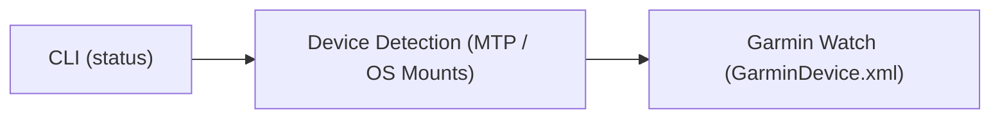

# Constitution

## 1. Purpose

A tool to connect a modern garmin watch to a laptop to exchange files over a USB connection.

## 2. Statements

Statements are verifiable assertions about the environment, hardware, or external boundaries that hold true.

| ID | Statement | Status | Verification Method | Impact / Traces |
|---|---|---|---|---|
| **STM-1** | The Garmin Venu X1 only supports the MTP protocol (no USB Mass Storage support). | Verified | USB device descriptor inspection (`lsusb` / OS device query) | Informs `FR-1` |
| **STM-2** | `GarminDevice.xml` is the file that holds the device's metadata. | Verified | File inspection within `GARMIN/` filesystem root | Informs `FR-2` |
| **STM-3** | Garmin devices expose a `GARMIN` directory at or near the root of the MTP mount, which contains the `GarminDevice.xml` file. | Verified | Mount structure inspection | Informs `FR-1`, `FR-2` |
| **STM-4** | Linux dynamically mounts MTP devices via GVFS under `/run/user/<uid>/gvfs` using an `mtp:` prefix. | Verified | Linux GVFS documentation/testing | Informs `FR-1` |
| **STM-5** | `GarminDevice.xml` contains specific metadata fields such as `Model/Description`, `Id`, `SoftwareVersion`, and `PartNumber`. | Verified | XML file inspection | Informs `FR-2` |
| **STM-6** | `GarminDevice.xml` utilizes XML namespaces, which complicates standard parsing if not stripped. | Verified | XML file inspection | Informs `FR-2` |

## 3. Requirements

### 3.1 Functional Requirements
- **FR-1: Linux Device Discovery**: Automatically detect connected Garmin watches across Linux mount points and GVFS/MTP paths (e.g., `/run/user/<uid>/gvfs`, `/media`, `/mnt`) without manual mount path configuration.
- **FR-2: Device Metadata Extraction**: Read and parse `GarminDevice.xml` (case-insensitive, XML namespaces stripped) to extract identifying metadata with graceful fallbacks on missing or malformed XML.
- **FR-3: CLI Status Inspection**: Provide a CLI command (`garmin-connector status`) to inspect and report device connection status and metadata to stdout in human-readable text or structured JSON (`--json`).

### 3.2 Non-Functional Requirements
- **NFR-1: Fault Tolerance**: Absence of a connected watch is a valid state (exits `0`), never an exception. Unexpected disconnects or missing metadata must not cause unhandled crashes.
- **NFR-2: Minimal Footprint**: Low CPU and memory overhead with zero external runtime dependencies.
- **NFR-3: Exclusive Dependencies**: All dependencies must be strictly exclusive to this repository and its chosen tech stack.

## 4. Architecture

## 5. Tech Stack

- **Language:** Go (Golang) — Chosen to satisfy NFR-2 (zero external runtime dependencies, compiled static binary) and NFR-3.

## 6. Out of Scope
- Graphical User Interface (GUI).
- Non-Linux operating systems (macOS, Windows).
- Course and activity file management, conversion, or sideloading.
- Multiple simultaneously connected watches.
