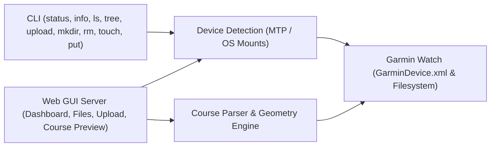

# Constitution

## 1. Purpose

A tool to connect a modern garmin watch to a laptop to exchange files over a USB connection.

## 2. Grounding Reality

### 2.1 External Facts
Facts are objective, verifiable truths about the external environment (hardware, third-party APIs, operating systems) that exist independently of this software.

| ID | Source / Origin | Fact | Verification Method | Impact / Traces |
|---|---|---|---|---|
| **FCT-1** | Physical Reality | The Garmin Venu X1 only supports the MTP protocol (no USB Mass Storage support). | USB device descriptor inspection (`lsusb` / OS device query) | Informs `FR-1` |
| **FCT-2** | Filesystem | `GarminDevice.xml` is the file that holds the device's metadata. | File inspection within `GARMIN/` filesystem root | Informs `FR-2`, `FR-5` |
| **FCT-3** | MTP Protocol | Garmin devices expose a `GARMIN` directory, but MTP often abstracts this behind a logical volume folder (e.g., `Internal Storage/`), meaning it may be nested 1-2 levels deep. | Mount structure inspection | Informs `FR-1`, `FR-2`, `FR-4`, `FR-5` |
| **FCT-4** | OS (Linux) | Linux dynamically mounts MTP devices via GVFS under `/run/user/<uid>/gvfs` using an `mtp:` prefix. | Linux GVFS documentation/testing | Informs `FR-1` |
| **FCT-5** | Filesystem | `GarminDevice.xml` contains specific metadata fields. `Description`, `SoftwareVersion`, and `PartNumber` are nested inside the `<Model>` tag. `Id` is at the root. Subsystem versions and Connect IQ app definitions are nested under `<MassStorageMode>` and `<Extensions>`. | XML file inspection | Informs `FR-2`, `FR-5` |
| **FCT-6** | XML Standard | `GarminDevice.xml` declares XML namespaces on its elements. A parser that matches elements by local name only (ignoring the namespace) can read the document directly, with no explicit namespace-stripping preprocessing step required. | XML file inspection; confirmed by successfully parsing a real, namespaced `GarminDevice.xml` with a local-name-matching parser (2026-09-17, PR #29) | Informs `FR-2`, `FR-5` |
| **FCT-7** | OS (Linux) | Linux USB mount paths are highly fragmented across Desktop Environments and volume managers (GVFS, udisks2, manual). | OS architecture | Informs `FR-1` |
| **FCT-8** | Filesystem | Garmin watches expose internal storage over MTP with unpredictable character casing (e.g., `GARMIN` vs `Garmin`). | Filesystem inspection | Informs `FR-1`, `FR-2`, `FR-4`, `FR-5` |
| **FCT-9** | OS Security | Scanning wildcard paths like `/run/user/*` on a multi-user Linux system triggers OS-level `EACCES` (Permission Denied) errors. | OS security model | Informs `FR-1` |
| **FCT-10** | MTP Protocol | MTP file traversal is measurably slower than local disk access; observed slowdowns across regeneration runs range from ~4.5x to ~75x depending on comparison basis (depth, cache state) — the direction is consistent across three independent runs, the exact magnitude is not. In practice, depth-limited traversal (`ASM-6`) keeps commands responsive (well under one second at the default `tree --depth 3`). | Timed comparisons against a real Venu X1 across PR #27 (0.62s full tree), PR #28 (4.5x relative), and PR #29 (`tree --depth 3` 0.298s vs. local `find` 0.004s, ~75x) | Informs `FR-4`, `FR-8` |
| **FCT-11** | MTP Protocol | MTP does not reliably expose standard POSIX metadata (symlinks, permissions, ownership). | MTP protocol limits | Informs `FR-4`, `FR-8` |
| **FCT-12** | Physical Reality | Garmin watches process new courses by reading compatible files (e.g., `.fit`, `.gpx`) placed into the `GARMIN/NewFiles/` directory on the internal storage. | Hardware documentation / testing | Informs `FR-6`, `FR-9`, `FR-10` |
| **FCT-13** | GVFS Protocol | GVFS FUSE mounts for MTP devices do not support standard POSIX writes in practice — confirmed for both file creation on a new file and a plain write to an already-existing file, both rejected as an unsupported operation. GVFS's own D-Bus Push transfer mechanism (see `FCT-15`) is the documented remedy, but has **not yet been empirically confirmed to work end-to-end**: a 2026-09-17 run observed a D-Bus Push attempt fail identically ("operation not supported") for both new and existing destination files. It is unresolved whether that failure reflects a genuine limitation of the D-Bus-push path or an artifact of running inside a sandboxed background job whose session/D-Bus isolation differs from the interactive desktop session that owns the GVFS mount. | Empirical verification on GVFS MTP mount; the unsupported-operation error was confirmed directly via low-level POSIX file APIs and via GVFS's own transfer tooling (PR #29, 2026-09-17) | Informs `FR-6`, `FR-9` |
| **FCT-14** | GPS Data Standard | Standard GPX course and activity files store coordinate sequences inside `<trkpt>` (within `<trk><trkseg>`) or `<rtept>` elements, with `lat` and `lon` attributes in decimal degrees and optional `<ele>` children in meters. | GPX 1.1 schema specification / file testing | Informs `FR-10` |
| **FCT-15** | GVFS Protocol | Completing a file write to a GVFS-mounted MTP directory when the direct write path is unsupported (`FCT-13`) requires invoking GVFS's own D-Bus Push transfer mechanism; no portable, in-process file-system call performs this — the capability is only exposed through GVFS's own client-side tooling or its D-Bus API. | Empirical verification on GVFS MTP mount (PR #29, 2026-09-17) | Informs `FR-6`, `FR-9` |
| **FCT-16** | OS (Linux) | Linux has no single, universal in-process mechanism to open a URL in the user's default web browser; doing so requires invoking a separate desktop-integration mechanism (a launcher utility or a desktop portal service), which may be absent on minimal or headless systems. | Linux desktop integration conventions | Informs `FR-7` |
| **FCT-17** | Physical Reality | Garmin watches (confirmed: Venu X1) ship with a `GARMIN/NewFiles` directory already present on internal storage; it does not need to be created by external tooling. | Filesystem inspection on a real Venu X1 (PR #29, 2026-09-17) | Informs `FR-6`, `FR-9` |
| **FCT-18** | GVFS Protocol | An actively mounted GVFS MTP device may not appear in GVFS's own mount-enumeration interfaces even while its mounted file-system path remains fully readable — directly scanning known mount-point paths is a more reliable discovery signal than querying GVFS's mount list. | Empirical verification: a real Venu X1 mount was fully readable while absent from GVFS's own mount listing (PR #29, 2026-09-17) | Informs `FR-1` |
| **FCT-19** | Filesystem / GVFS | Modifying a GVFS-mounted MTP device (creating directories, deleting files or directories, creating/copying files) may trigger `EOPNOTSUPP` via direct POSIX system calls, necessitating fallback to desktop GVFS client tooling or D-Bus APIs. | Empirical testing on Linux GVFS MTP mount points | Informs `FR-11` |

### 2.2 Assumptions
Assumptions are beliefs about user behavior, workflows, or integration needs that justify architectural decisions.

| ID | Source / Origin | Assumption | Verification Method | Impact / Traces |
|---|---|---|---|---|
| **ASM-1** | Product Decision | Users and external systems invoke the tool on-demand to query state, rather than connecting to a persistent background daemon. | User research / workflow analysis | Informs `FR-3`, `FR-4`, `FR-5`, `FR-8`, `FR-9` |
| **ASM-2** | Stakeholder Request | External scripts/tools require machine-readable structured output to consume device status headlessly. | Integration requirements | Informs `FR-3`, `FR-4`, `FR-5` |
| **ASM-3** | User Research | Users typically connect only one Garmin watch via USB at any given time; surfacing the first detected device is sufficient. | User research | Scopes `FR-1`, `FR-8`, `FR-9` |
| **ASM-4** | Product Decision | Knowing a device is connected is more valuable than strict metadata accuracy; graceful degradation is preferred over a hard failure. | Product decision | Scopes `FR-2`, `FR-5` |
| **ASM-5** | Product Decision | For file inspection, basic filesystem structure and metadata (name, size, modification time) are sufficient; complete POSIX file semantics are unnecessary. | Product decision | Scopes `FR-4`, `FR-8`, `FR-10` |
| **ASM-6** | UX Principle | Deep recursive directory traversal is only useful if it returns quickly; imposing limits prevents the CLI from hanging indefinitely on MTP endpoints. | User experience | Scopes `FR-4`, `FR-8` |
| **ASM-7** | Product Decision | The user is responsible for providing well-formed course files; restricting uploads by file extension (`.fit`, `.gpx`) is sufficient, and deep file schema validation is unnecessary. | Product decision | Scopes `FR-6`, `FR-9`, `FR-10` |
| **ASM-8** | User Preference | Users seeking a graphical interface prefer launching an on-demand local web server bound to localhost accessible via a standard web browser, without background daemon requirements. | User request | Informs `FR-7`, `FR-8`, `FR-9`, `FR-10` |
| **ASM-9** | UX / Performance | High-frequency GPS course tracks contain tens of thousands of points that cause SVG layout thrashing; downsampling to <= 500 points preserves route geometry and elevation contours while guaranteeing responsive browser rendering. | Performance benchmarking / SVG rendering limits | Scopes `FR-10` |
| **ASM-10** | UX / Visualization | Raw geographic coordinates in fractions of a degree distort SVG marker radii and container scaling; normalizing projected Cartesian coordinates onto a fixed viewport canvas (e.g. 300x180) with a uniform aspect-ratio scale factor guarantees crisp, bounded vector map rendering across any route scale. | Empirical UI verification on GPX courses | Scopes `FR-10` |
| **ASM-11** | UX Principle | Users launching the web GUI are on a desktop Linux environment with a working browser-launch mechanism (`FCT-16`) and a configured default browser; automatic browser launching may silently do nothing on headless/minimal systems, but the server itself remains fully usable via the printed URL. | User environment observation | Scopes `FR-7` |
| **ASM-12** | UX Principle | Direct watch filesystem manipulation commands (`mkdir`, `rm`, `touch`, `put`) operate immediately on device storage without an intermediate recycle bin or undo facility; user confirmation or recursive deletion requires explicit flags. | Product design / CLI standards | Scopes `FR-11` |

## 3. Requirements

### 3.1 Functional Requirements
- **FR-1: Linux Device Discovery**: Automatically detect connected Garmin watches across Linux mount points and GVFS/MTP paths (e.g., `/run/user/<uid>/gvfs`, `/media`, `/mnt`) without manual mount path configuration.
- **FR-2: Device Metadata Extraction**: Read and parse `GarminDevice.xml` (case-insensitive, XML namespaces stripped) to extract identifying metadata with graceful fallbacks on missing or malformed XML.
- **FR-3: CLI Status Inspection**: Provide a CLI command (`garmin-connector status`) to inspect and report device connection status and metadata to stdout in human-readable text or a machine-readable structured data format.
- **FR-4: Read-Only Filesystem Inspection**: Provide CLI commands (`ls`, `tree`) to explore the watch's internal filesystem structure and basic metadata without modifying contents.
- **FR-5: Detailed Diagnostics and Storage Inspection**: Provide a CLI command (`garmin-connector info`) to report real-time filesystem capacity metrics, installed Connect IQ applications, and sub-component firmware versions in human-readable text or a machine-readable structured data format.
- **FR-6: Course Upload**: Provide a CLI command (`garmin-connector upload <file>`) to transfer a route/course file to the watch's incoming directory (e.g., `GARMIN/NewFiles/`), allowing the device to process it upon disconnection.
- **FR-7: Web-Based GUI Dashboard**: Provide an on-demand local web server (e.g., `garmin-connector web`) that serves an interactive, responsive browser dashboard displaying real-time watch connection status, storage capacity metrics, and device diagnostics, backed by local JSON API endpoints.
- **FR-8: Web GUI Column View File Browser**: Provide an interactive Column View (macOS Finder-style Miller columns) file browser within the web GUI to navigate watch directories lazily, inspect file metadata and details in a preview pane, and download files from the watch.
- **FR-9: Web GUI Course Upload**: Provide an interactive drag-and-drop and file-picker upload interface within the web GUI to transfer route/course files (`.fit`, `.gpx`) to the watch's incoming directory (`GARMIN/NewFiles/`), backed by a local REST endpoint.
- **FR-10: Web GUI Course Route & Elevation Preview**: Provide an offline vector route map and elevation profile preview for `.gpx` course files within the web GUI, computing distance, elevation gain/loss, and track geometry for both device courses and staged uploads. `.fit` course files remain uploadable (`FR-6`, `FR-9`) but are out of scope for visual preview — see [gui/course-preview.md](gui/course-preview.md) Non-Goals.
- **FR-11: Watch Filesystem Manipulation**: Provide CLI commands (`mkdir`, `rm`, `touch`, `put`) to manipulate the watch's internal filesystem (creating directories, removing files/directories, creating empty files, and copying local files onto arbitrary watch paths) relative to the internal storage root with case-insensitive path resolution and fallback mechanisms for MTP mount limitations.

### 3.2 Non-Functional Requirements
- **NFR-1: Fault Tolerance**: Absence of a connected watch is a valid state (exits `0`), never an exception. Unexpected disconnects or missing metadata must not cause unhandled crashes.
- **NFR-2: Standalone Execution**: Low CPU and memory overhead. The tool must be executable by the end-user without requiring them to pre-install language runtimes, package managers, or third-party libraries.
- **NFR-3: Exclusive Dependencies**: All dependencies must be strictly exclusive to this repository and its chosen implementation.

## 4. Architecture

## 5. Out of Scope
- Native desktop GUI frameworks (e.g., GTK, Qt, Electron) — GUI is provided strictly via local browser interface.
- Non-Linux operating systems (macOS, Windows).
- Multiple simultaneously connected watches.
