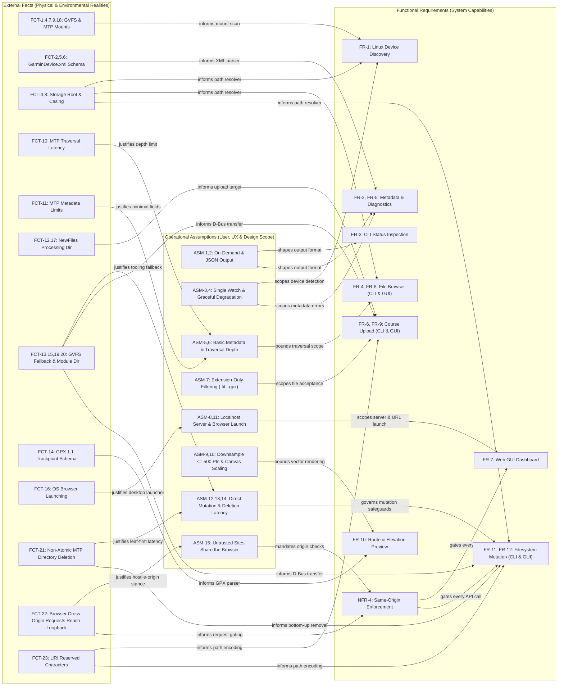
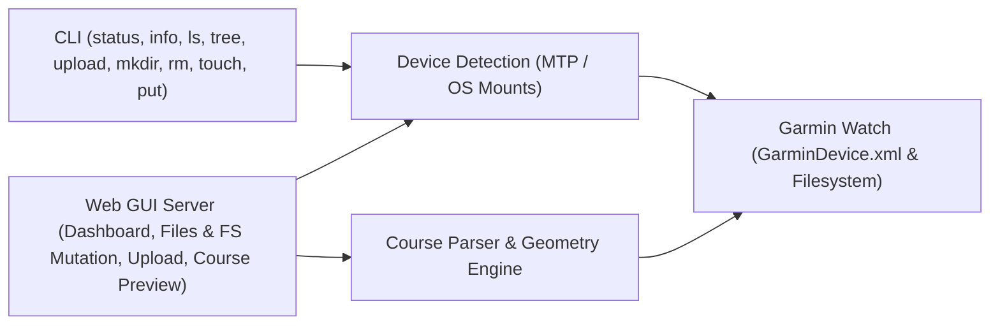

# Constitution

## 1. Purpose & Axioms

### 1.1 Purpose

A tool to connect a modern garmin watch to a laptop to exchange files over a USB connection.

### 1.2 Core Axiom: Tech-Stack Agnostic Specifications

All specifications in `specs/` (including this Constitution, Requirements, Facts, Assumptions, and Feature Specifications) MUST remain strictly technology-stack agnostic.

- **Specifications define WHAT, not HOW**: Specifications describe external physical and operational truths (hardware, protocols, OS contracts), user workflows, functional requirements, and data contracts. They never presuppose or mandate a specific programming language, compiler, language-specific package structure, or language-specific runtime library.
- **Tech-Stack Isolation**: Concrete technology decisions (such as programming language, framework choices, internal module/package layouts, and standard library usage) belong exclusively in [tech-stack.md](./tech-stack.md) and Architecture Decision Records ([adrs/](./adrs/)).
- **No Language Symbol Leaks**: Specifications MUST NOT reference language-specific packages, internal module paths, function signatures of a specific language implementation, or language runtime mechanics.
- **Agent and Contributor Contract**: Any software engineer or AI agent working on this repository MUST uphold this boundary. When proposing, modifying, or creating specifications, all content must be formulated such that a clean implementer could build the system in any suitable language (e.g., Go, Rust, Python, C, Zig) without altering the specification.

### 1.3 Core Axiom: The Causal Cascade Law

External facts (`FCT-X`) and operational assumptions (`ASM-Y`) are the root of reality for this system.
Whenever an external fact changes, is invalidated, or an assumption is verified into a fact:
1. **Requirements First**: Functional Requirements (`FR-X`) and Non-Functional Requirements (`NFR-X`) MUST be re-evaluated to reflect the new boundaries of what is possible, mandatory, or prohibited.
2. **Tech Stack Subordination**: The technology stack (`specs/tech-stack.md` and `specs/adrs/`) is strictly subordinate to the requirements and facts. If the current language, runtime, or architectural constraints cannot natively satisfy the updated requirements without breaching NFRs, an Architecture Decision Record (ADR) MUST be authored to evaluate or migrate the stack.
3. **Spec Propagation**: All dependent specifications under `specs/` MUST be updated prior to code modification.
4. **Derived Implementation**: Application code in `cmd/` and `internal/` is regenerated or rewritten as a derived artifact of the updated specifications following [`specs/workflows/fact-change-cascade.md`](workflows/fact-change-cascade.md) and [`specs/workflows/regeneration.md`](workflows/regeneration.md). Code changes MUST NEVER bypass or precede specification changes.

## 2. Grounding Reality

### 2.1 External Facts
Facts are objective, verifiable truths about the external environment (hardware, third-party APIs, operating systems) that exist independently of this software.

| ID | Source / Origin | Fact | Verification Method | Impact / Traces |
|---|---|---|---|---|
| **FCT-1** | Physical Reality | The Garmin Venu X1 only supports the MTP protocol (no USB Mass Storage support). | USB device descriptor inspection (`lsusb` / OS device query) | Informs `FR-1` |
| **FCT-2** | Filesystem | `GarminDevice.xml` is the file that holds the device's metadata. | File inspection within `GARMIN/` filesystem root | Informs `FR-2`, `FR-5` |
| **FCT-3** | MTP Protocol | Garmin devices expose a `GARMIN` directory, but MTP often abstracts this behind a logical volume folder (e.g., `Internal Storage/`), meaning it may be nested 1-2 levels deep. | Mount structure inspection | Informs `FR-1`, `FR-2`, `FR-4`, `FR-5` |
| **FCT-4** | OS (Linux) | Linux dynamically mounts MTP devices via GVFS under `/run/user/<uid>/gvfs` using an `mtp:` prefix. | Linux GVFS documentation/testing | Informs `FR-1` |
| **FCT-5** | Filesystem | `GarminDevice.xml` contains specific metadata fields. `Description`, `SoftwareVersion`, and `PartNumber` are nested inside the `<Model>` tag. `Id` is at the root. Subsystem versions and Connect IQ app definitions are nested under `<MassStorageMode>` and `<Extensions>`. | XML file inspection | Informs `FR-2`, `FR-5` |
| **FCT-6** | XML Standard | `GarminDevice.xml` declares XML namespaces on its elements. A parser that matches elements by local name only (ignoring the namespace) can read the document directly, with no explicit namespace-stripping preprocessing step required. | XML file inspection and local-name matching verification on namespaced `GarminDevice.xml` | Informs `FR-2`, `FR-5` |
| **FCT-7** | OS (Linux) | Linux USB mount paths are highly fragmented across Desktop Environments and volume managers (GVFS, udisks2, manual). | OS architecture | Informs `FR-1` |
| **FCT-8** | Filesystem | Garmin watches expose internal storage over MTP with unpredictable character casing (e.g., `GARMIN` vs `Garmin`). | Filesystem inspection | Informs `FR-1`, `FR-2`, `FR-4`, `FR-5` |
| **FCT-9** | OS Security | Scanning wildcard paths like `/run/user/*` on a multi-user Linux system triggers OS-level `EACCES` (Permission Denied) errors. | OS security model | Informs `FR-1` |
| **FCT-10** | MTP Protocol | MTP file traversal is measurably slower than local disk access (observed slowdowns range from ~4.5x to ~75x depending on directory depth and cache state). Depth-limited traversal (`ASM-6`) keeps commands responsive (well under one second at default depth 3). | Timed traversal benchmarks against physical Garmin MTP mounts | Informs `FR-4`, `FR-8` |
| **FCT-11** | MTP Protocol | MTP does not reliably expose standard POSIX metadata (symlinks, permissions, ownership). | MTP protocol limits | Informs `FR-4`, `FR-8` |
| **FCT-12** | Physical Reality | Garmin watches process new courses by reading compatible files (e.g., `.fit`, `.gpx`) placed into the `GARMIN/NewFiles/` directory on the internal storage. | Hardware documentation / testing | Informs `FR-6`, `FR-9`, `FR-10` |
| **FCT-13** | GVFS Protocol | GVFS FUSE mounts for MTP devices reject standard POSIX file creation and in-place writes (`open` with `O_CREAT` returns an unsupported operation error). Invoking desktop GVFS client tooling (`gio copy`, `gio mkdir`, `gio remove`) succeeds once the GLib module directory (`GIO_MODULE_DIR`, e.g. `/usr/lib/*-linux-gnu/gio/modules`) containing `libgvfsdbus.so` is loaded and paths are addressed via native `mtp://<host>/<rel_path>` URIs or local GVFS paths. Sandboxed or snap-launched environments inheriting unpopulated module directory paths fail to load GVFS backends and return unsupported operation errors. | Empirical verification on physical Garmin MTP mounts on Linux | Informs `FR-6`, `FR-9`, `FR-11`, `FR-12` |
| **FCT-14** | GPS Data Standard | Standard GPX course and activity files store coordinate sequences inside `<trkpt>` (within `<trk><trkseg>`) or `<rtept>` elements, with `lat` and `lon` attributes in decimal degrees and optional `<ele>` children in meters. | GPX 1.1 schema specification / file testing | Informs `FR-10` |
| **FCT-15** | GVFS Protocol | Completing a file write to a GVFS-mounted MTP directory when direct filesystem write calls are unsupported (`FCT-13`) requires invoking GVFS's D-Bus transfer mechanism via desktop client tooling (`gio copy`) or native D-Bus APIs. | Empirical verification on GVFS MTP mounts | Informs `FR-6`, `FR-9`, `FR-11`, `FR-12` |
| **FCT-16** | OS (Linux) | Linux has no single, universal in-process mechanism to open a URL in the user's default web browser; doing so requires invoking a desktop launcher utility or desktop portal service, which may be absent on minimal or headless systems. | Linux desktop integration conventions | Informs `FR-7` |
| **FCT-17** | Physical Reality | Garmin watches (confirmed: Venu X1) ship with a `GARMIN/NewFiles` directory already present on internal storage; it does not need to be created by external tooling. | Filesystem inspection on physical Garmin hardware | Informs `FR-6`, `FR-9` |
| **FCT-18** | GVFS Protocol | An actively mounted GVFS MTP device may not appear in GVFS's mount-enumeration interfaces even while its mounted filesystem path remains fully readable — directly scanning known mount-point paths is a more reliable discovery signal than querying GVFS's mount list. | Empirical verification on Linux GVFS MTP mounts | Informs `FR-1` |
| **FCT-19** | Filesystem / GVFS | Modifying a GVFS-mounted MTP device (creating directories, deleting files or directories, copying files) may trigger unsupported operation errors via direct POSIX filesystem calls, necessitating fallback to desktop GVFS client tooling or D-Bus APIs. | Empirical testing on Linux GVFS MTP mount points | Informs `FR-11`, `FR-12` |
| **FCT-20** | OS (Linux) / Desktop Environments | Sandboxed applications, package runtimes (e.g. snap/flatpak), or containerized environments often export invalid or non-existent `GIO_MODULE_DIR` environment variables to child processes. When `GIO_MODULE_DIR` points to an empty or non-existent directory, GLib fails to dynamically load `libgvfsdbus.so` and loses GVFS MTP backend capabilities, returning unsupported operation errors on commands like `gio copy`. Detecting valid host module directories (e.g. `/usr/lib/*-linux-gnu/gio/modules` containing `libgvfsdbus.so`) and overriding `GIO_MODULE_DIR` restores full GVFS client functionality. | Empirical verification on Linux desktop environments | Informs `FR-6`, `FR-9`, `FR-11`, `FR-12` |
| **FCT-21** | MTP Protocol / GVFS | MTP and the GVFS MTP backend do not support atomic or non-empty directory deletion (`gio remove` rejects non-empty directories with `Directory not empty`). Deleting a directory on an MTP device requires bottom-up recursive traversal and deletion of all descendant files and subdirectories before the target directory can be deleted. | Empirical verification on physical Garmin hardware over GVFS MTP mount | Informs `FR-11`, `FR-12` |
| **FCT-22** | Web Platform (Browser Security Model) | Any web page open in the user's browser may issue cross-origin requests to loopback addresses (`127.0.0.1`, `localhost`) without a preflight when the request is a "simple" one: any `GET`, or a `POST` whose body is form-encoded, multipart, or `text/plain`. The browser attaches an `Origin` header naming the foreign page but does not block the request, and a server that does not inspect `Origin`, `Host`, or the declared `Content-Type` will act on it exactly as if the request came from its own page. DNS rebinding additionally lets a remote hostname resolve to the loopback address, so a foreign `Host` header can reach a loopback listener. Binding to loopback alone therefore does not isolate an unauthenticated local HTTP API from other web content. | Empirical: cross-origin `POST` with `Origin: https://evil.example` and `Content-Type: text/plain` carrying a JSON body, and a `GET` with a foreign `Host`, were both accepted by a running instance (2026-09-18) | Informs `FR-7`, `FR-9`, `FR-12`, `NFR-4` |
| **FCT-23** | URI Standard (RFC 3986) / GVFS | In a URI, `#` begins the fragment, `%` begins a percent-escape, and `?` begins the query; spaces and non-ASCII characters are not permitted unencoded in the path. When a watch path is handed to GVFS client tooling as a native `mtp://<host>/<path>` URI, every path segment MUST be percent-encoded or the tooling addresses the wrong object (`ride #2.gpx` is truncated at `#`; `100%.gpx` is an invalid escape). The same tooling also accepts the plain local GVFS mount path (`/run/user/<uid>/gvfs/mtp:host=.../...`), which needs no encoding. | RFC 3986 §2.2/§3.5; probe of the URI conversion on a filename containing `#`, `%` and a space (2026-09-18) | Informs `FR-6`, `FR-9`, `FR-11`, `FR-12` |

### 2.2 Assumptions
Assumptions are beliefs about user behavior, workflows, or integration needs that justify architectural decisions.

| ID | Source / Origin | Assumption | Verification Method | Impact / Traces |
|---|---|---|---|---|
| **ASM-1** | Product Decision | Users and external systems invoke the tool on-demand to query state, rather than connecting to a persistent background daemon. | User research / workflow analysis | Informs `FR-3`, `FR-4`, `FR-5`, `FR-8`, `FR-9` |
| **ASM-2** | Stakeholder Request | External scripts/tools require machine-readable structured output to consume device status headlessly. | Integration requirements | Informs `FR-3`, `FR-4`, `FR-5` |
| **ASM-3** | User Research | Users typically connect only one Garmin watch via USB at any given time; surfacing the first detected device is sufficient. | User research | Scopes `FR-1`, `FR-8`, `FR-9` |
| **ASM-4** | Product Decision | Knowing a device is connected is more valuable than strict metadata accuracy; graceful degradation is preferred over a hard failure. | Product decision | Scopes `FR-2`, `FR-5` |
| **ASM-5** | Product Decision | For file inspection, basic filesystem structure and metadata (name, size, modification time) are sufficient; complete POSIX file semantics are unnecessary. | Product decision | Scopes `FR-4`, `FR-8`, `FR-10` |
| **ASM-6** | UX Principle | Deep recursive directory traversal is only useful if it returns quickly; imposing limits prevents the CLI from hanging indefinitely on MTP endpoints. | User experience | Scopes `FR-4`, `FR-8` |
| **ASM-7** | Product Decision | The user is responsible for providing well-formed course files; restricting uploads by file extension (`.fit`, `.gpx`) is sufficient, and deep file schema validation is unnecessary. | Product decision | Scopes `FR-6`, `FR-9`, `FR-10` |
| **ASM-8** | User Preference | Users seeking a graphical interface prefer launching an on-demand local web server bound to localhost accessible via a standard web browser, without background daemon requirements. | User request | Informs `FR-7`, `FR-8`, `FR-9`, `FR-10` |
| **ASM-9** | UX / Performance | High-frequency GPS course tracks contain tens of thousands of points that cause SVG layout thrashing; downsampling to <= 500 points preserves route geometry and elevation contours while guaranteeing responsive browser rendering. | Performance benchmarking / SVG rendering limits | Scopes `FR-10` |
| **ASM-10** | UX / Visualization | Raw geographic coordinates in fractions of a degree distort SVG marker radii and container scaling; normalizing projected Cartesian coordinates onto a fixed viewport canvas (e.g. 300x180) with a uniform aspect-ratio scale factor guarantees crisp, bounded vector map rendering across any route scale. | Empirical UI verification on GPX courses | Scopes `FR-10` |
| **ASM-11** | UX Principle | Users launching the web GUI are on a desktop Linux environment with a working browser-launch mechanism (`FCT-16`) and a configured default browser; automatic browser launching may silently do nothing on headless/minimal systems, but the server itself remains fully usable via the printed URL. | User environment observation | Scopes `FR-7` |
| **ASM-12** | UX Principle | Direct watch filesystem manipulation commands (`mkdir`, `rm`, `touch`, `put`) operate immediately on device storage without an intermediate recycle bin or undo facility; user confirmation or recursive deletion requires explicit flags. | Product design / CLI standards | Scopes `FR-11`, `FR-12` |
| **ASM-13** | Platform Requirement | Linux desktop systems interacting with Garmin watches mounted via GVFS MTP have standard GLib/GIO client tooling (`gio`) and the GVFS D-Bus daemon (`gvfsd-mtp`) installed as part of the base desktop installation. | Desktop Linux distribution baseline analysis | Informs `FR-6`, `FR-9`, `FR-11`, `FR-12` |
| **ASM-14** | UX / Performance | Users requesting recursive directory deletion (`rm -r` in CLI or folder delete in GUI) accept the round-trip latency of bottom-up sequential item deletion (`FCT-21`) over MTP as a necessary consequence of the MTP protocol's lack of atomic subtree removal. | Product design & protocol constraint analysis | Scopes `FR-11`, `FR-12` |
| **ASM-15** | Threat Model | While the local web GUI is open, the same browser profile is also used to visit arbitrary, untrusted websites. Those sites must be treated as hostile: the only party permitted to mutate or upload to the watch through the local HTTP API is the GUI's own served page. No authentication is required because the tool is single-user and loopback-bound (`ASM-8`), but same-origin enforcement is. | Threat-model review of a loopback HTTP server with state-changing endpoints (`FCT-22`) | Informs `NFR-4`; scopes `FR-7`, `FR-9`, `FR-12` |

### 2.3 Grounding Reality Map: Relations Between Facts, Assumptions, and Requirements

The following diagram illustrates the explicit causal and scoping relationships between external Facts, operational Assumptions, and Functional Requirements. Facts grounded in external physical and OS realities justify design Assumptions and directly inform Requirements, while Assumptions scope and constrain how Requirements are satisfied:

## 3. Requirements

### 3.1 Functional Requirements
- **FR-1: Linux Device Discovery**: Automatically detect connected Garmin watches across Linux mount points and GVFS/MTP paths (e.g., `/run/user/<uid>/gvfs`, `/media`, `/mnt`) without manual mount path configuration.
- **FR-2: Device Metadata Extraction**: Read and parse `GarminDevice.xml` (case-insensitive, XML namespaces stripped) to extract identifying metadata with graceful fallbacks on missing or malformed XML.
- **FR-3: CLI Status Inspection**: Provide a CLI command (`garmin-connector status`) to inspect and report device connection status and metadata to stdout in human-readable text or a machine-readable structured data format.
- **FR-4: Read-Only Filesystem Inspection**: Provide CLI commands (`ls`, `tree`) to explore the watch's internal filesystem structure and basic metadata without modifying contents.
- **FR-5: Detailed Diagnostics and Storage Inspection**: Provide a CLI command (`garmin-connector info`) to report real-time filesystem capacity metrics, installed Connect IQ applications, and sub-component firmware versions in human-readable text or a machine-readable structured data format.
- **FR-6: Course Upload**: Provide a CLI command (`garmin-connector upload <file>`) to transfer a route/course file to the watch's incoming directory (e.g., `GARMIN/NewFiles/`), allowing the device to process it upon disconnection.
- **FR-7: Web-Based GUI Dashboard**: Provide an on-demand local web server (e.g., `garmin-connector web`) that serves an interactive, responsive browser dashboard displaying real-time watch connection status, storage capacity metrics, and device diagnostics, backed by local JSON API endpoints.
- **FR-8: Web GUI Column View File Browser**: Provide an interactive Column View (macOS Finder-style Miller columns) file browser within the web GUI to navigate watch directories lazily, inspect file metadata and details in a preview pane, and download files from the watch.
- **FR-9: Web GUI Course Upload**: Provide an interactive drag-and-drop and file-picker upload interface within the web GUI to transfer route/course files (`.fit`, `.gpx`) to the watch's incoming directory (`GARMIN/NewFiles/`), backed by a local REST endpoint.
- **FR-10: Web GUI Course Route & Elevation Preview**: Provide an offline vector route map and elevation profile preview for `.gpx` course files within the web GUI, computing distance, elevation gain/loss, and track geometry for both device courses and staged uploads. `.fit` course files remain uploadable (`FR-6`, `FR-9`) but are out of scope for visual preview — see [gui/course-preview.md](gui/course-preview.md) Non-Goals.
- **FR-11: Watch Filesystem Manipulation**: Provide CLI commands (`mkdir`, `rm`, `touch`, `put`) to manipulate the watch's internal filesystem (creating directories, removing files/directories, creating empty files, and copying local files onto arbitrary watch paths) relative to the internal storage root with case-insensitive path resolution and fallback mechanisms for MTP mount limitations. Neither the storage root nor the top-level `GARMIN` directory may be removed or overwritten by any surface (CLI or GUI); the safeguard is identical on both.
- **FR-12: Web GUI Filesystem Manipulation**: Provide interactive filesystem manipulation within the Web GUI file browser (creating new directories, uploading arbitrary files to selected folders, deleting files/folders, and creating empty files) backed by local REST endpoints.

### 3.2 Non-Functional Requirements
- **NFR-1: Fault Tolerance**: Absence of a connected watch is a valid state for every *inspection* surface (`status`, `info`, `ls`, `tree`, the web dashboard) — it exits `0` / answers `200`, never raises an exception. A *mutation* (`upload`, `mkdir`, `rm`, `touch`, `put`, or their GUI equivalents) requested while no watch is connected is a request that could not be honoured and MUST be reported as a failure (exit `1` / `503`), so that scripts do not mistake a no-op for success. Unexpected disconnects or missing metadata must not cause unhandled crashes in either case.
- **NFR-2: Standalone Execution**: Low CPU and memory overhead. The tool must be executable by the end-user without requiring them to pre-install language runtimes, package managers, or third-party libraries.
- **NFR-3: Exclusive Dependencies**: All dependencies must be strictly exclusive to this repository and its chosen implementation.
- **NFR-4: Same-Origin Enforcement**: The local web server MUST act only on requests that originate from the page it serves itself (`ASM-15`, `FCT-22`). At minimum it MUST (a) reject any request whose `Host` header does not name the address it is bound to, (b) reject any state-changing request (anything other than `GET`/`HEAD`/`OPTIONS`) that carries an `Origin` or `Referer` naming a different origin, and (c) reject any state-changing request whose declared `Content-Type` is not the one the endpoint defines, so that a browser-issued "simple" cross-origin request can never reach a mutation. Rejections MUST be reported with `403 Forbidden` and MUST happen before device discovery or any body parsing. Binding to a non-loopback address (`--host`) does not relax this rule and MUST print a warning that the API is reachable from the network without authentication.

## 4. Architecture

## 5. Out of Scope
- Native desktop GUI frameworks (e.g., GTK, Qt, Electron) — GUI is provided strictly via local browser interface.
- Non-Linux operating systems (macOS, Windows).
- Multiple simultaneously connected watches.
