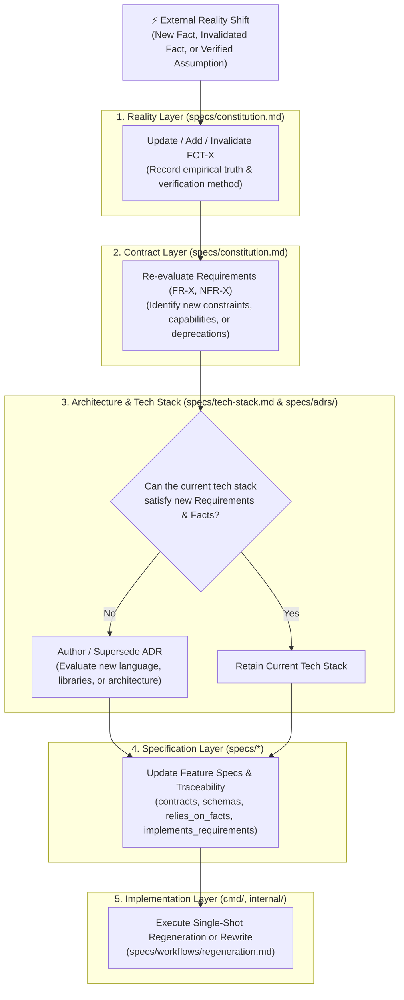

# Workflow: Fact Change Cascade (Facts → Requirements → Tech Stack → Rewrite)

**Trigger:** An external reality changes — an existing fact (`FCT-X`) is invalidated, a new fact is discovered from hardware/OS research, or an assumption (`ASM-Y`) is verified and promoted to a fact.

---

## The Core Axiom

In a spec-driven system, **external facts are the root of reality**. 
Code is never edited directly when real-world conditions shift. Instead, every change in facts must deterministically cascade down through each layer of the system:



---

## Phase 1: Fact Recording (`specs/constitution.md`)

1. **Record the Fact**:
   - If adding a new fact: Assign the next `FCT-X` in Section 2.1 of [`specs/constitution.md`](../constitution.md).
   - If promoting an assumption: Remove `ASM-Y` and introduce `FCT-X` (following [`validate-assumption.md`](validate-assumption.md)).
   - If invalidating a fact: Move `FCT-X` to the invalidated/historical section with the invalidation date and reason.
2. **Document Verification**: State the empirical testing method, hardware model, OS version, or protocol evidence in the *Verification Method* column.
3. **Verify Tech-Stack Agnosticism**: Ensure the fact statement mentions only hardware, protocol, or operating system truths—never application-level language constructs, packages, or frameworks.

---

## Phase 2: Requirements Audit (`specs/constitution.md`)

Trace the impact of the fact change onto the system's Functional Requirements (`FR-X`) and Non-Functional Requirements (`NFR-X`):

1. **Gap Analysis**:
   - *Does this fact expose an unhandled real-world edge case?* → Draft a new `FR-X`.
   - *Does this fact render an existing requirement impossible or obsolete?* → Deprecate or rewrite the affected `FR-X` (see [`deprecate-feature.md`](deprecate-feature.md)).
   - *Does this fact alter performance, security, or deployment constraints?* → Update or add `NFR-X`.
2. **Update Constitution Section 3**: Commit requirement changes using RFC 2119 keywords (`MUST`, `SHOULD`, `MAY`).
3. **Update Reality Map Diagram**: Update the Mermaid diagram in Section 2.3 of [`specs/constitution.md`](../constitution.md) to reflect the new edges connecting `FCT-X` to its dependent `FR-X` / `NFR-X`.

---

## Phase 3: Tech Stack & Architecture Evaluation Gate

The tech stack is **ephemeral and subordinate** to the requirements. It exists solely to satisfy the current requirements within the boundaries of known facts.

Evaluate the following checklist against [`specs/tech-stack.md`](../tech-stack.md):

| Evaluation Question | Impact if "Yes" | Action Required |
|---|---|---|
| Does the new requirement/fact require OS APIs or protocols unsupported by the current language/toolchain? | Tech stack cannot satisfy NFRs | Propose alternate language/runtime via new ADR |
| Does satisfying the fact require introducing third-party dependencies that violate `NFR-2` or `NFR-3`? | Dependency model breach | Author ADR proposing library or architectural decoupling |
| Does the fact change deployment targets (e.g. desktop daemon vs. standalone binary vs. browser extension)? | Platform packaging shift | Update `tech-stack.md` build configuration & ADRs |
| Can the current tech stack comfortably satisfy the updated requirements without architectural compromises? | Current stack remains optimal | Retain current tech stack; note fact confirmation in ADR |

**Outcome**:
- **If stack change is required**: Draft a new Architecture Decision Record in [`specs/adrs/`](../adrs/) (e.g. `000X-migrate-to-<new-tech>.md`), marking the prior ADR as superseded. Update [`specs/tech-stack.md`](../tech-stack.md).
- **If stack remains unchanged**: Proceed with the existing toolchain.

---

## Phase 4: Feature Spec Cascade (`specs/*`)

Propagate the requirement and fact changes into the namespaced feature specs:

1. **Global Trace**: Run ripgrep across `specs/` to find all specs referencing the affected `FCT-X` or `FR-X`:
   ```sh
   rg "FCT-X|FR-Y" specs/
   ```
2. **Spec Updates**:
   - Update frontmatter: `relies_on_facts`, `implements_requirements`, `relies_on_assumptions`.
   - Update normative text: Adjust behaviors, data contracts, error cases, and CLI/GUI flows to reflect the new reality.
   - If a completely new capability is introduced, author a new spec from [`specs/templates/spec-template.md`](../templates/spec-template.md) (see [`create-feature-spec.md`](create-feature-spec.md)).

---

## Phase 5: Implementation Regeneration or Rewrite

Once all upstream specs are coherent and reviewed:

1. **Assess Scope of Code Impact**:
   - **Localized Impact**: If the change affects an isolated module, implement the spec diff directly in a single pass and run the test suite.
   - **Architectural / Tech Stack Shift**: If the tech stack changed or core assumptions were dismantled, perform a **clean-slate regeneration** following [`specs/workflows/regeneration.md`](regeneration.md).
2. **Gate Execution**:
   - Run the tech stack test suite (e.g. `go test ./...`).
   - Run static analysis checks (e.g. `go vet ./...`, formatting).
   - Verify CLI commands and Web GUI manually against the newly documented facts.
3. **Commit & Sync**:
   - Commit spec changes and regenerated code together so that specs and implementation never drift.
